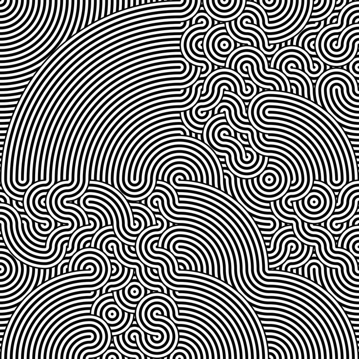
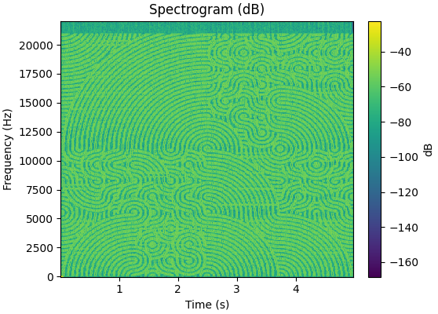

# sfft-griffin

sfft-griffin is an open-source image-to-audio converter that re-synthesises pictures, spectrogram art, and glitch graphics into playable sound using an auto-tuned Griffin–Lim phase reconstruction pipeline. Built for experimental sound design, multimedia installations, and research on image sonification, the project draws inspiration from the excellent [Image to Audio](https://nsspot.herokuapp.com/imagetoaudio/) demo while focusing on a fully offline Rust workflow.

## Getting Started

```bash
# Build the release binary
cargo build --release

# Convert the bundled example image
cargo run --release -- -i examples/image.jpg -o examples/image.wav
```

Need a one-liner? Use `./run.sh examples/image.jpg` to render audio and open a spectrogram preview.

Pass `--help` for the full list of options. Frequently tuned controls include:

| Flag | Default | Purpose |
| ---- | ------- | ------- |
| `--duration <sec>` | `5.0` | Target audio length |
| `--fft-size <N>` | `2048` | FFT size (power of two) |
| `--iterations <N>` | `48` | Griffin–Lim iterations |
| `--mapping <mode>` | `power` | Magnitude mapping (`power`, `linear`, `db`) |
| `--gamma <val>` | `1.0` | Gamma for `power` mapping |
| `--scale <val>` | `15.0` | Magnitude scaling factor |
| `--per-frame-norm` | `false` | Normalize individual time frames |
| `--float32-out` | `true` | Write 32‑bit float output instead of 16‑bit |

## Example Gallery

The repository ships with a compact test scene that mixes bright edges and dark voids—great for demos, glitch audio textures, and spectral beat slicing. Feel free to drop additional assets into `examples/` to build your own sound pack.

<div align="center">
  
  
</div>

Listen to the generated clip directly:

<audio controls>
  <source src="examples/image.wav" type="audio/wav" />
  Your browser does not support the audio element.
</audio>

## Pipeline Overview

1. Load the image, convert to grayscale (alpha treated as transparency), and optionally invert or adjust density.
2. Resize to match the STFT grid (`frames × bins`) with either linear or logarithmic frequency spacing.
3. Map pixel values to magnitudes via linear/power/dB mapping with optional auto dB range.
4. Apply conditioning (percentile clamp, smoothing, median filter, band-pass, spectral gate, and optional per-frame normalization).
5. Run fast Griffin–Lim with momentum to recover phase and collapse back to the time domain.
6. Post-process the waveform with DC blocking, fades, filters, normalization, limiter, and output gain shaping.

## Tooling & Extras

- `examples/` – sample assets and rendered outputs you can replace with your own visuals.
- `run.sh` – helper script that invokes the CLI and runs the Python spectrogram preview.
- `scripts/audio_histogram.py` & `scripts/analyze_audio.py` – optional utilities for waveform statistics and visual diagnostics.
- `scripts/requirements.txt` – Python dependencies required by the helper scripts (`numpy`, `scipy`, `matplotlib`).

Install the optional Python tooling with:

```bash
python3 -m venv .venv
source .venv/bin/activate
pip install -r scripts/requirements.txt
```

## Project Layout

```
├── Cargo.toml / Cargo.lock    # Rust crate definition
├── src/main.rs                # Griffin–Lim CLI implementation
├── examples/                  # Sample assets & rendered previews
├── scripts/                   # Optional helper scripts (Python & shell)
└── run.sh                     # Convenience wrapper for demos
```

## Development Notes

- Requires a recent stable Rust toolchain (`rustup toolchain install stable`).
- `cargo fmt` and `cargo clippy --all-targets --all-features` keep the codebase tidy.
- `.gitignore` excludes local builds, Python caches, and large generated WAVs outside `examples/`.

Contributions, demo ideas, and bug reports are welcome. Keywords: image-to-audio synthesis, griffin-lim reconstruction, spectrogram music, image sonification, glitch sound design, spectral art.
